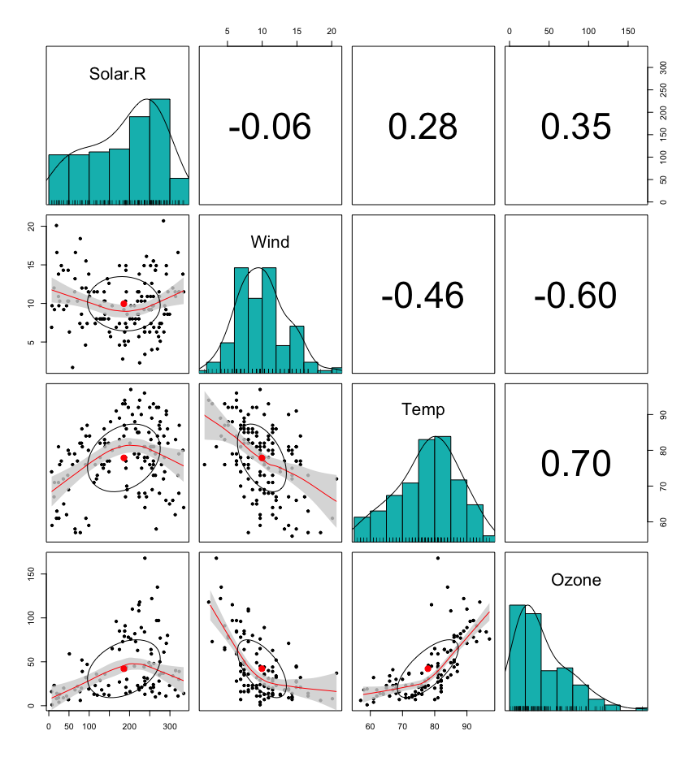

# Paired Scatter Plot

```r
install.packages("psych")
library(psych)

dat1 <- subset(airquality, select=c(Solar.R, Wind, Temp, Ozone))
pairs.panels(dat1, method="pearson", hist.col="#00BBBB", density=T, ellipses=T, ci=T)
```

