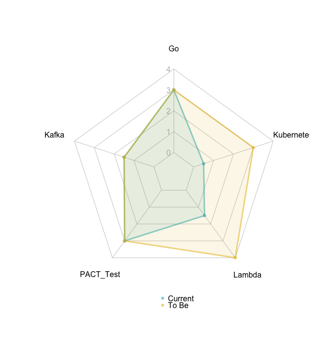

# Skills Chart

```r
install.packages("fmsb")
library(fmsb)

skills <- data.frame(
  Go = c(3, 3),
  Kafka = c(1.5, 1.5),
  PACT_Test = c(3, 3),
  Lambda = c(1.5, 4),
  Kubernetes = c(0.5, 3)
)
rownames(skills) <- c("Current", "To Be")

max_min <- data.frame(
  Go = c(4, 0),
  Kafka = c(4, 0),
  PACT_Test = c(4, 0),
  Lambda = c(4, 0),
  Kubernetes = c(4, 0)
)
rownames(max_min) <- c("Max", "Min")

df <- rbind(max_min, skills)

colors <- c("#00AFBB80", "#E7B80080")
radarchart(df, axistype = 1,
           pcol = colors, # line color
           pfcol = scales::alpha(colors, 0.1), # fill color
           plty = 1, # line type
           plwd = 3,  # line width
           cglcol = "grey", # net line color
           cglty = 1, # net line type
           cglwd = 0.8, # net width
           axislabcol = "grey", # axis label color
           caxislabels = seq(from=0, to=4),
           vlabels = colnames(df),
           maxmin = T)
legend(x = "bottom", 
       legend = rownames(df)[3:4], 
       col=colors, 
       bty="n", 
       pch = 20)
```


